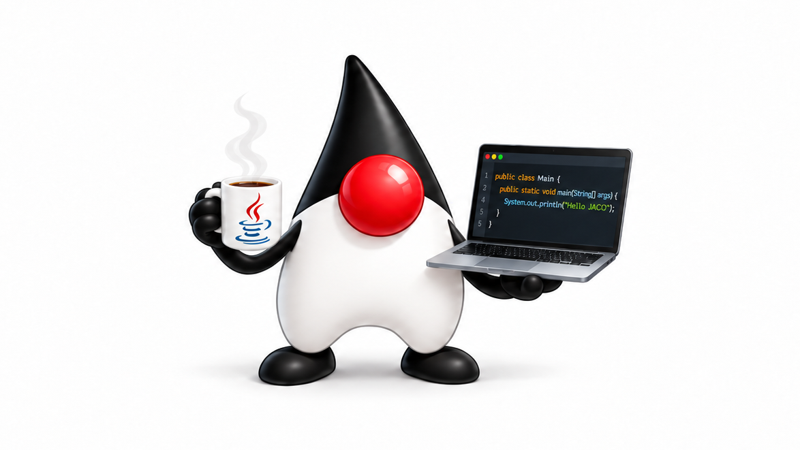

<p align="center">
  
</p>

<h1 align="center">JACO</h1>
<div style="display: flex; align-items: center; gap: 12px; margin: 20px 0;">
  <div style="flex: 1; height: 1px; background: #ccc;"></div>
  <span style="color: #999; font-size: 14px;"><strong>JAVA CODER</strong></span>
  <div style="flex: 1; height: 1px; background: #ccc;"></div>
</div>
<p align="center">用 Java 21 从零构建的终端 AI 编程助手</p>

JACO 将模型对话、工具调用和权限确认串成完整的 agent 循环。你可以在终端中让它阅读代码、修改文件、执行命令，或委派只读子 agent 调查问题。模型通过 OpenAI 兼容的 Chat Completions 接口接入，核心 agent 与终端界面独立，便于扩展工具和交互方式。

## 功能概览

- **终端交互**：流式输出、等待动画、Markdown 渲染、代码高亮与中文表格对齐。
- **工具调用**：读写文件、浏览目录、搜索代码、执行命令、检索归档与委派子任务。
- **权限控制**：只读工具自动放行，写入、命令执行和子任务需确认；支持按工具在当前会话内放行。
- **会话管理**：自动保存和恢复会话，支持查看历史、切换会话与中断当前任务。
- **上下文管理**：大工具输出自动归档，长对话分层压缩，保留可检索的原始历史。

## 快速开始

### 1. 构建

需要 **JDK 21 或更高版本**和 **Maven**。在项目根目录执行：

```bash
mvn package
```

构建后生成包含运行依赖的 `target/jaco.jar`。

### 2. 配置模型

首次执行以下命令会输出配置示例；请手动创建 `~/.jaco/config.yaml`，然后重新启动：

```bash
java -jar target/jaco.jar
```

Windows 下默认配置路径为 `%USERPROFILE%\.jaco\config.yaml`。设置 `JACO_HOME` 可以更改配置、会话和日志所在的数据目录。

以 DeepSeek 为例：

```yaml
active: deepseek
providers:
  deepseek:
    base_url: https://api.deepseek.com
    api_key: ${DEEPSEEK_API_KEY}
    model: deepseek-chat
    temperature: 0.7
```

在启动 JACO 的终端中设置 API Key。

**PowerShell：**

```powershell
$env:DEEPSEEK_API_KEY = "你的 API Key"
```

**Bash / Zsh：**

```bash
export DEEPSEEK_API_KEY="你的 API Key"
```

### 3. 开始对话

```bash
java -jar target/jaco.jar
```

**启动时所在的目录就是工作目录。** 如需操作其他项目，先进入目标目录，再使用 JAR 的绝对路径启动：

```bash
cd /path/to/your-project
java -jar /path/to/jaco/target/jaco.jar
```

进入交互界面后，直接输入任务，例如：

```text
帮我梳理这个项目的结构，并说明入口和核心模块。
检查配置加载逻辑，找出可能导致启动失败的原因。
帮我修改这个方法，并运行相关测试。
```

## 交互与权限

### 命令与快捷键

| 命令 / 快捷键 | 作用 |
| --- | --- |
| `/help` | 显示可用命令 |
| `/new` | 创建新会话，清空当前上下文与权限放行记录 |
| `/sessions` | 按新到旧列出会话，`*` 标记当前会话 |
| `/switch <会话 ID>` | 切换会话，支持唯一 ID 前缀 |
| `/exit` 或 `Ctrl+D` | 退出 |
| `Ctrl+C` | 中断当前轮：取消模型流、终止命令子进程、拒绝待确认操作；已生成内容保留进会话 |

启动时自动恢复最近一次会话；没有历史会话时创建新会话。

### 内置工具

工具由模型根据任务调用，无需手动输入工具名。

| 工具 | 用途 | 默认权限 |
| --- | --- | --- |
| `read_file` | 带行号读取文件，支持分页 | 自动放行 |
| `list_dir` | 浏览目录 | 自动放行 |
| `grep` | 搜索文件内容 | 自动放行 |
| `recall` | 按关键词或正则检索当前会话归档，支持分页 | 自动放行 |
| `write_file` | 写入文件 | 需确认 |
| `run_command` | 在工作目录执行 shell 命令，返回合并输出与退出码 | 需确认 |
| `task` | 委派具有独立上下文的只读子 agent，返回最终调查报告 | 需确认 |

确认提示支持：

| 输入 | 含义 |
| --- | --- |
| `y` | 仅允许本次调用 |
| `a` | 在当前会话内允许该工具的后续调用 |
| `n` | 拒绝调用，拒绝结果反馈给模型 |

命中危险命令黑名单的调用会直接拒绝，不能通过 `y` 或 `a` 放行。

文件工具的路径访问限定在工作目录及 `workspace.extra_roots` 中。`run_command` 使用本机 shell 执行，这个文件路径限制不构成命令进程的系统级沙箱。命令超时为 120 秒；输出读取量受限，回填最多保留末尾 50,000 字符，再经过单条工具输出的归档处理。

子 agent 只能使用只读工具，不能写文件、执行命令或递归创建子 agent；中间探索过程不进入父会话上下文，最终报告作为工具结果返回。

## 配置参考

### 模型服务

在 `providers` 中定义命名配置，通过 `active` 选择启动时使用的配置；只有一个配置时可以省略 `active`。

服务需兼容 OpenAI Chat Completions 的流式响应与工具调用协议。`base_url` 支持服务根地址、带 `/v1` 的地址或完整的 `/chat/completions` 地址；未包含 `/chat/completions` 时会自动追加该路径，请按服务实际接口填写。

配置中的 `${VAR}` 会从环境变量替换；未设置的变量会替换为空字符串。当前启动检查要求 `api_key` 非空，使用不需要鉴权的本地服务时也需填写一个非空占位值。未知配置字段会被忽略。

### 可选配置

以下字段与 `active`、`providers` 位于同一级：

```yaml
# system_prompt: 自定义系统提示词
log_level: INFO
shell: auto
max_iterations: 25
context_limit: 65536
max_tool_result_chars: 8000
workspace:
  extra_roots:
    - D:/other-project
```

| 字段 | 默认值 | 说明 |
| --- | --- | --- |
| `system_prompt` | 内置提示词 | 自定义系统提示词 |
| `log_level` | `INFO` | 日志级别，可设为 `DEBUG` 排查问题 |
| `shell` | `auto` | 支持 `auto`、`bash`、`cmd`、`powershell` |
| `max_iterations` | `25` | 单轮最大模型调用次数 |
| `context_limit` | `65536` | 上下文压缩的 token 基准，应按模型窗口调整 |
| `max_tool_result_chars` | `8000` | 单条工具输出的归档触发字符数 |
| `workspace.extra_roots` | 空列表 | 文件工具允许访问的额外目录 |

完整字段定义见 [JacoConfig](src/main/java/com/jaco/config/JacoConfig.java) 和 [ProviderConfig](src/main/java/com/jaco/config/ProviderConfig.java)。

### 数据存储

默认数据目录为 `~/.jaco/`；设置 `JACO_HOME` 后，下列路径随之迁移：

```text
~/.jaco/
├── config.yaml                  # 模型与运行配置
├── history                      # 终端输入历史
├── sessions/
│   ├── <会话 ID>.json            # 会话记录
│   └── <会话 ID>.archive.jsonl   # 压缩历史与大工具输出归档
└── logs/                        # 运行日志
```

日志写入文件，终端输出留给交互界面。

## 上下文管理

JACO 用两层机制控制发送给模型的上下文体积：

1. **单条工具输出归档**：超过 `max_tool_result_chars` 时，将该条输出完整写入归档，在对话中保留头尾预览与归档提示。
2. **轮级压缩**：每轮开始检查上下文体积，达到 `context_limit` 的 70% 时触发，目标压至 40%。依次将旧工具结果替换为简短占位、归档旧轮并留下骨架摘要，必要时使用模型摘要兜底。

轮级压缩保护最近两轮，并保持工具调用与工具结果配对。归档保留原始内容，可通过 `recall` 检索；检索返回的长条目仍有展示截断。若服务端报告上下文超限，会强制压缩并重试一次。

## 架构与扩展

项目按包划分职责，`llm` 和 `agent` 不依赖 `tui`。

| 包 | 职责 |
| --- | --- |
| `tui` | 基于 JLine 3 的 REPL，消费 `TurnEvent`，处理渲染、确认、命令和中断 |
| `agent` | `AgentRunner` 驱动工具循环与只读子 agent；`ContextCompactor` 管理压缩与归档 |
| `llm` | 手写 OpenAI 兼容 SSE 客户端，处理流式响应、工具调用增量、重试和取消 |
| `tool` | 工具接口与注册表、7 个内置工具、权限钩子和文件路径沙箱 |
| `render` | Markdown 流式渲染、代码高亮、表格对齐与 CJK 显示宽度计算 |
| `hook` | agent 生命周期钩子，可接入权限、审计与续轮逻辑 |
| `session` | 会话 JSON 保存、恢复与 JSONL 归档 |
| `config` | YAML 配置、环境变量替换与模型配置选择 |

主要扩展入口：

- **新增工具**：实现 `Tool` 接口并通过 `ToolRegistry.register()` 注册，无需修改 agent 循环。
- **生命周期钩子**：实现 `AgentHook`；`onStop` 返回 `true` 可以请求续轮。
- **渲染后端**：渲染器输出带语义颜色的 `Span`，终端使用 ANSI 后端，可据此扩展其他界面。

代码高亮支持 Java、Python、JavaScript、Bash 和 JSON，其他语言原样显示；终端颜色自动探测 truecolor，并可降级为 256 色。

## 开发与测试

```bash
mvn test
```

测试使用 JUnit 5，覆盖工具输出归档、上下文压缩、会话存储与切换、归档检索及只读子 agent 等行为。`mvn package` 会执行测试并打包可运行 JAR。
